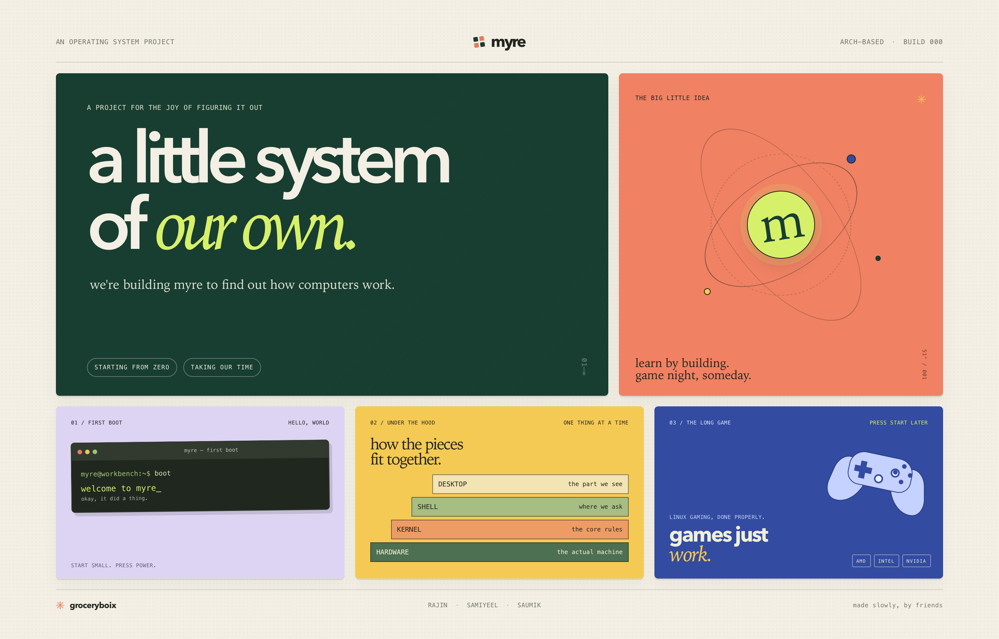

# myre

myre will be an arch distro by groceryboix. we wanna learn how computers work, try things ourselves, and keep building from what we learn.

we're starting small. the long-term idea is an arch-based linux system that feels good to use and plays games well. it will be better than bazzite. for now, we're taking our time and learning stuff.

## groceryboix

- [Rajin](https://rajinkhan.com)
- [Samiyeel](https://samiyeelalim.com)
- [Saumik](https://saumik-kabbya.vercel.app/)
