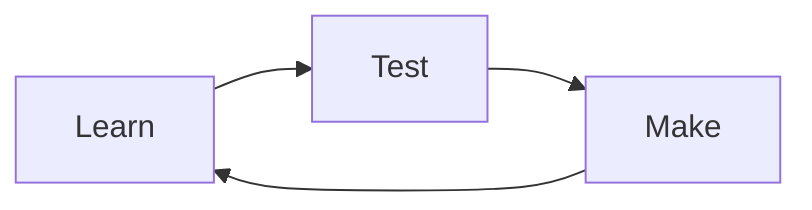

# Markdown test bench

This is one test note for the myre reader. If anything below looks like raw Markdown on the site, the reader needs another pass.

## Text and links

Plain text, **bold text**, *italic text*, ~~crossed-out text~~, and `inline code` should each look different. Here's a [link to the myre board](https://myre-os.vercel.app/).

> A regular blockquote should stay a blockquote, not turn into a callout.

> [!NOTE]
> A note callout should have its own label and a blue edge. It can hold **formatted text** too.

> [!WARNING]
> A warning should be easy to spot without relying on color alone.

## Lists

1. Read a small piece of the system.
2. Try it somewhere safe.
3. Write down what actually happened.

- [x] Markdown reaches Supabase from Git
- [ ] A real lesson from the crew replaces this test

## Table

| Part | Rough job | Question to try |
| :--- | :--- | :--- |
| Kernel | Talks to hardware | What does it handle at boot? |
| Shell | Runs commands | Which shell do we want? |
| Desktop | Gives us a workspace | What should feel different? |

## Code

```bash
uname -r
cat /etc/os-release
```

```js
const steps = ["learn", "test", "make"];
for (const step of steps) console.log(step);
```

## Diagram



## Image


---

That's the test. A real note can be much shorter.
